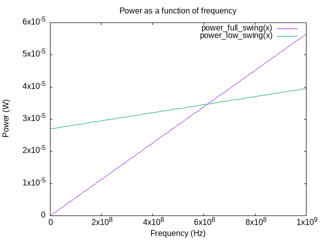

#+title: ECE 403 Assignment 10
#+options: tags:nil todo:nil num:nil toc:nil title:nil
#+author: Waridh (Bach) Wongwandanee
#+setupfile: ../latex-setup.config
#+property: header-args:emacs-lisp :exports none :tangle no
#+property: header-args:elisp :exports none :tangle no
#+LATEX_HEADER: \chead{Assignment 10}
* Question 1
What is the average activity of the output of a 32-bit binary counter when incrementing every clock cycle?

Here is how we are going to think about this.
Every bit in the counter will change after some amount of cycle, and since this is a simple counter, we could determine the number of cycles it would take before a bit would toggle.
This value is taken as the following.

\[2^{\text{bit position}}\]

Where the bit position is a 0-based bit index starting from the LSB.
Now, we could find the rate of toggling by inverting this value.

\[2^{- \left( \text{bit position} \right)}\]

Now since we are looking at the output of a binary counter, each bit only has a weight of \(1/32\).
From here, we could find the contribution of the different bits by summing the product of the rate of toggle with the contribution to the activity factor.
This is represented with the following expression.

\[\alpha(n) = \frac{1}{n} \sum_{i=0}^{n-1} \frac{1}{2^i}\]

Where \(n\), is the number of bits of the counter output.

#+name: lst-alpha-solver
#+caption: Racket implementation used to find \(\alpha\)
#+begin_src racket :lang racket :exports code :cache yes :var counter-size=32
(define (alpha n)
  (define (alpha-iter acc iter)
    (if (>= iter n)
        acc
        (alpha-iter (+ acc (/ 1 (arithmetic-shift 1 iter)))
                    (+ iter 1))))
  (* (/ 1 n) (alpha-iter 0 0)))

(exact->inexact
 (alpha counter-size))
#+end_src

#+RESULTS[e5c4e628ac91f7f5240462dea5dc779d12671f37]: lst-alpha-solver
: 0.062499999985448085

From here, we found that the \(\alpha\) of the 32 bit counter is call_lst-alpha-solver[:exports results]() {{{results(=0.062499999985448085=)}}}.

* Question 2
For a static CMOS with a clock frequency of \qty{1}{\giga\hertz}, \(V_{dd}=\qty{1.2}{\volt}\), with a total internal parasitic capacitance per bit of the counter of \qty{40}{\femto\farad} and a load capacitance per bit of \qty{90}{\femto\farad}, what is the dynamic power consumption? Assume no glitches in the combinational logic.

#+name: eq-dyn-pow
\begin{equation}
P_{dyn} = \alpha f_{clk} V_{dd}^2 C
\end{equation}

Where we have the following value for \(C\).

\[C = 32 \times \left( \qty{40}{\femto\farad} + \qty{90}{\femto\farad}\right)\]

We could just compute this using racket again.
The code is available in listing [[lst-dynamic-power]].

#+name: lst-dynamic-power
#+caption: Racket implementation used to find the dynamic power of the output to the counter.
#+begin_src racket :lang racket :exports code :cache yes :var alpha=lst-alpha-solver(counter-size=32) f_clk=1e9 V_dd=1.2 capacitance=(+ 40e-15 90e-15)
(define (dyn-power alpha capacitance f_clk V_dd)
  (* alpha f_clk (* V_dd V_dd) capacitance))
(~a (exact->inexact
 (dyn-power alpha f_clk V_dd capacitance)) " W" )
#+end_src

#+RESULTS[1c5e15476a14a84e35a61c971f0dbcc834bce604]: lst-dynamic-power
: 1.2674999997048872e-18 W

And so we found that the power used is call_lst-dynamic-power[:exports results]() {{{results(=1.2674999997048872e-12 W=)}}}.

* Question 3
:properties:
:header-args:ocaml: :session default :exports code
:end:

You have been asked to design the signalling used on \qty{500}{\micro \meter} wire on an integrated circuit to minimize power consumption. Your options are full-swing static CMOS or low voltage swing \qty{200}{\milli\volt} signalling, both single-ended. The minimum width wire has a capacitance of \qty{250}{\pico\farad\per \meter}. The system clock is \qty{500}{\mega\hertz} and the signal has an activity of 0.45.\(V_{DD}\) is \qty{0.9}{\volt}. Both receivers have an input capacitance of \qty{30}{\femto \farad}. The receiver for low voltage signalling consumes \qty{30}{\micro\ampere} from \(V_{DD}\) continuously (assume independent of \(f_{c}\) and noise margins are sufficient).
Assume that unspecified values are negligible.

#+name: eq-low-swing-dyn
\begin{equation}
P_{dyn, low-swing} = \alpha C f V_{swing} V_{driver}
\end{equation}

** Part a
Find the total capacitance driven by the full-swing static CMOS driver.

Find the power consumption of the driver.

Looking at the capacitance of the wire, we have the following expression.
\[\qty{500}{\micro\meter} \times \qty{250}{\pico\farad\per\meter}\]

#+name: lst-wire-cap
#+caption: Quick code used to find the wire capacitance.
#+begin_src racket :lang racket :exports code
(* 500e-6 250e-12)
#+end_src

With this, we could add the value of the input capacitance of the receiver to the wire capacitance to get the total value of the capacitance.

#+name: lst-total-cap
#+caption: Quick code used to find the wire capacitance.
#+begin_src racket :lang racket :exports code :var wire-cap=lst-wire-cap()
(+ wire-cap 30e-15)
#+end_src

This results in call_lst-total-cap[:exports results]() {{{results(=1.5500000000000002e-13=)}}} \unit{\farad}.

Due to having static power consumption be unspecified, we assume that only dynamic power are contributing to the full swing power usage.

Using ([[eq-dyn-pow]]), we are able to find the power usage of the full swing driver.

#+name: lst-full-swing-power
#+caption: The expression for the power usage of the driver when using full swing signalling.
#+begin_src racket :lang racket :exports code :var total-cap=lst-total-cap
(* 500e6 (* 0.9 0.9) total-cap 0.45)
#+end_src

Using listing [[lst-full-swing-power]], we are able to find \(P_{full-swing}\) to be call_lst-full-swing-power() \unit{\watt}.

** Part b
Using low swing signalling, find the power consumption of the driver plus receiver.
The driver and receiver must take their power from \(V_{DD}\).

The dynamic power expression for the low-swing signalling is available in ([[eq-low-swing-dyn]]).
In addition to the dynamic power, there is static power usage in this version of the system as well, which could be modelled with the following expression.

\[P_{total} = P_{dyn} + P_{static}\]

\[P_{static} = V_{DD} I_{static}\]

#+caption: The relevant parameters.
#+begin_src ocaml
let v_dd = 0.9;;
let i_static = 30e-6;;
let v_swing = 200e-3;;
let c = 1.55e-13;;
let f = 500e6;;
let activity = 0.45;;
#+end_src

#+RESULTS:
: 0.45

#+caption: The expression for the powers for this problem, written in OCaml.
#+begin_src ocaml
let power_static v i = v *. i;;
let power_dynamic v_d v_s c f alpha = v_d *. v_s *. c *. f *. alpha;;
let power v_d v_s c f alpha i_s =
  (power_static v_d i_s)
  +. (power_dynamic v_d v_s c f alpha);;
#+end_src

#+RESULTS:
: <fun>

#+name: lst-swing-power
#+caption: The result of applying the static power on the input values
#+begin_src ocaml :exports code
power v_dd v_swing c f activity i_static;;
#+end_src

The power consumption of the voltage swing implementation was then found to be call_lst-swing-power() {{{results(=3.327750000000001e-05=)}}} \unit{\watt}.

** Part c
At what clock frequency would power consumption of the two options be equal?

We are going to do two things here, first, we are going to plot the relationship between the powers, which could be seen in figure [[lst-power-of-frequency]].
After doing that, we are computing the exact frequency by using an equality seen below.

#+name: lst-power-of-frequency
#+begin_src gnuplot :exports results :results file :file ./images/power-of-freq.png
set title "Power as a function of frequency"
set ylabel "Power (W)"
set xlabel "Frequency (Hz)"

V_dd = 0.9
I_static = 30e-6
V_swing = 200e-3
C = 1.55e-13
alpha = 0.45

power_swing(v_d, v_s, x) = v_d * v_s * C * alpha * x
power_full_swing(x) = power_swing(V_dd, V_dd, x)
power_low_swing(x) = power_swing(V_dd, V_swing, x) + ( I_static * V_dd )
set xrange[0:1e9]
plot power_full_swing(x), power_low_swing(x)

#+end_src

#+caption: The plot of the power consumption of the two signalling schemes.
#+attr_latex: :width 0.7\linewidth
#+RESULTS: lst-power-of-frequency

\begin{align*}
  V_{DD} I_{static} + \alpha C f V_{swing} V_{DD} &= \alpha C f V_{DD}^{2} \\
  I_{static} + \alpha C f V_{swing} &= \alpha C f V_{DD} \\
  I_{static} &= f \alpha C \left( V_{DD} - V_{swing} \right) \\
  f &= \frac{I_{static}}{\alpha C \left( V_{DD} - V_{swing} \right)}
\end{align*}

#+name: lst-same-power-freq
#+caption: The code that will evaluate the frequency where the power consumption is the same.
#+begin_src ocaml :exports code
i_static /. (activity *. c *. (v_dd -. v_swing));;
#+end_src

From evaluating this, we found that power consumption is the same when the frequency is call_lst-same-power-freq[:exports results]() {{{results(=614439324.1167434=)}}} \unit{\hertz}.
