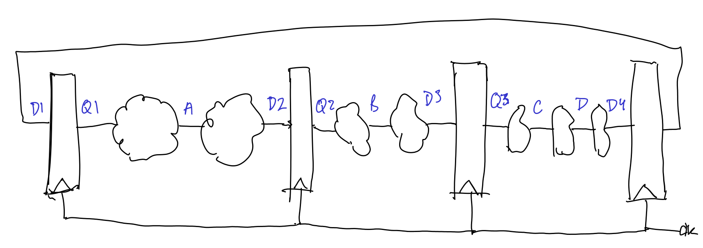
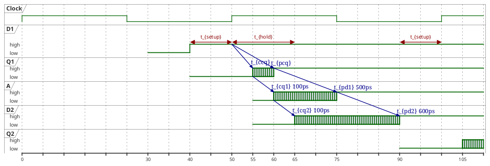

#+title: ECE 403 Assignment 7
#+options: tags:nil todo:nil num:nil toc:nil title:nil
#+author: Waridh (Bach) Wongwandanee
#+setupfile: ../latex-setup.config
#+LATEX_HEADER: \chead{Assignment 7}
#+property: header-args:emacs-lisp :tangle no :exports none
* Question 1
Find the fastest safe clock frequency for a 3-cycle
pipeline that feeds back on itself. Solve using D-FFs
for synchronization. Verify that hold time is met.
- \(T_{skew} = \qty{0}{\pico\s}\)
- 7 stages of combinational logic, each with \(T_{cd-group} = \qty{100}{\pico\s}\) and, used in the provided sequence, \(T_{pd}=\left\{ {500, 600, 300, 400, 500, 200, 110} \right\} \unit{\pico \s}\).
  Synchronize the \qty{110}{\pico\s} stage output to the clock.
- latches and D-FFs : \(T_{setup}=\qty{40}{\pico\s}, T_{hold}=\qty{30}{\pico\s}, T_{pcq}=\qty{45}{\pico\s}, T_{ccq}=\qty{30}{\pico\s}, T_{pdq}=\qty{50}{\pico\s}, T_{cdq}=\qty{35}{\pico\s}\)

We are going to start off with our assumptions.
We assume here that the combinational component must be executed in order, and the order is given by listing in the question.
This means that you could only group stages adjacent to each other.
Additionally, there shall be 3 stages of combinational logic.
With these assumptions, we can now start to build our pipeline.

In our vision, the new pipeline shall have the following grouping of combinational circuits.

#+begin_example
{500 + 600, 300 + 400, 500 + 200 + 100}
#+end_example

Where the first and second group has two stages, and the third group has 3 stages.
The system is available in figure [[fig-schematic]].

#+name: fig-schematic
#+caption: The block diagram for the proposed system.
#+attr_latex: :width 0.7\linewidth

#+name: lst-q1-timing
#+begin_src plantuml :exports results :results file :file ./images/q1-timing.png
@startuml
clock "Clock" as clk with period 50
robust "D1" as d1
robust "Q1" as q1
robust "A" as a
robust "D2" as d2
robust "Q2" as q2

d1 has high,low
q1 has high,low
a has high,low
d2 has high,low
q2 has high,low
@0
d1 is {hidden}
@30
d1 is low
@40
d1 is high
q1 is low
d1@40 <-> @50 : t_{setup}
@50
d1@50 -> q1@55 : t_{ccq}
d1 -> q1@60 : t_{pcq}
d1@50 <-> @65 : t_{hold}
@55
q1 is {high,low}
a is low
d2 is low
q1 -> a@60 : t_{cq1} 100ps
@60
q1 is high
q1 -> a@75 : t_{pd1} 500ps
a is {high,low}
a -> d2@65 : t_{cq2} 100ps
@65
d2 is {high,low}
@75
a is high
a -> d2@90 : t_{pd2} 600ps
@90
q2 is low
d2 is high
d1@90 <-> @100 : t_{setup}

@105
q2 is {high,low}
@enduml
#+end_src

#+attr_latex: :width 0.7\linewidth
#+caption: Timing diagram used to understand how the configuration of the system affects the timing parameters.
#+RESULTS: lst-q1-timing

#+name: eq-min-size
\begin{equation}
T_c \geq t_{pcq} + t_{pd} + t_{setup} + t_{skew}
\end{equation}

#+name: lst-min-period
#+begin_src emacs-lisp :var t_pcq=45 t_pd=500 t_setup=40 t_skew=0
(+ t_pcq t_pd t_setup t_skew)
#+end_src

#+name: eq-hold-time
\begin{equation}
t_{hold} + t_{skew} \leq t_{ccq} + t_{cd}
\end{equation}

#+name: lst-hold-time-verification
#+begin_src emacs-lisp :var t_hold=30 t_skew=0 t_ccq=30 t_cd=100
(<= (+ t_hold t_skew) (+ t_ccq t_cd))
#+end_src

For a working pipeline architecture, the minimum period is the time it takes to correctly execute the slowest stage of the pipeline.
We have made the first stage of the pipeline the slowest stage of the pipeline.
From here, we do our computation in a spreadsheet, illustrated in table [[tab-q1]].
The maximum frequency with no skew was found to be \qty{840.336}{\mega\hertz}.

#+name: tab-q1
#+caption: The computed values. The value of minimum \(T_{c}\) was computed from ([[eq-min-size]]). The verification of the hold time is done through ([[eq-hold-time]]). In this case, \(t_{skew}=0\). In this case \(t_{hold} = \qty{30}{\pico\s}\). The frequency was found to be \qty{840.336}{\mega\hertz}.
|         Stage |           \(t_{pd}\) | total contamination delay | min \(T_{c}\) | meets hold time |
|---------------+-------------------+---------------------------+--------+-----------------|
|             1 |              1100 |                       200 |   1190 | yes             |
|             2 |               700 |                       200 |    790 | yes             |
|             3 |               800 |                       300 |    890 | yes             |
|---------------+-------------------+---------------------------+--------+-----------------|
|    Max period |              1190 |                           |        |                 |
| Max frequency | 840336134.4537815 |                           |        |                 |
#+TBLFM: @2$2='(+ 500 600)::@2$3='(* 2 100)::@2$4..@4$4='(org-sbe "lst-min-period" (t_pd $2) (t_skew 0) (t_setup 40) (t_pcq 50))::@2$5..@4$5='(if (org-sbe "lst-hold-time-verification" (t_cd $3) (t_ccq 30) (t_skew 0) (t_hold 30)) "yes" "no")::@3$2='(+ 300 400)::@3$3='(* 2 100)::@4$2='(+ 500 200 100)::@4$3='(* 3 100)::@5$2='(max @I$4..@II$4);N::@6$2='(/ 1.0 (* 1e-12 @-1));N

* Question 2
Repeat with \(T_{skew} = \qty{50}{\pico\s}\), direction unknown.

With unknown direction, we should put the skew in the worse case direction for both the hold time and setup time constraints.
With this, we could use ([[eq-min-size]]) and ([[eq-hold-time]]) to find out what the safest safe clock frequency is, and if hold time is violated.
The table with the intermediate results of the computation is available in table [[tab-q2]].
The maximum frequency with the skew at \qty{50}{\pico\s} was found to be \qty{806.45}{\mega\hertz}.

#+name: tab-q2
#+caption: The computed values. The value of minimum \(T_{c}\) was computed from ([[eq-min-size]]). The verification of the hold time is done through ([[eq-hold-time]]). In this case, \(t_{skew}=\qty{50}{\pico\s}\). Additionally, the effective hold time with the skew applied is \(t_{hold} = \qty{80}{\pico\s}\). The frequency was found to be \qty{806.45}{\mega\hertz}.
|         Stage |           \(t_{pd}\) | total contamination delay | min \(T_{c}\) | meets hold time |
|---------------+-------------------+---------------------------+------------+-----------------|
|             1 |              1100 |                       200 |       1240 | yes             |
|             2 |               700 |                       200 |        840 | yes             |
|             3 |               800 |                       300 |        940 | yes             |
|---------------+-------------------+---------------------------+------------+-----------------|
|    Max period |              1240 |                           |            |                 |
| Max frequency | 806451612.9032258 |                           |            |                 |
#+TBLFM: @2$2='(+ 500 600)::@2$3='(* 2 100)::@2$4..@4$4='(org-sbe "lst-min-period" (t_pd $2) (t_skew 50) (t_setup 40) (t_pcq 50))::@2$5..@4$5='(if (org-sbe "lst-hold-time-verification" (t_cd $3) (t_ccq 30) (t_skew 50) (t_hold 30)) "yes" "no")::@3$2='(+ 300 400)::@3$3='(* 2 100)::@4$2='(+ 500 200 100)::@4$3='(* 3 100)::@5$2='(max @I$4..@II$4);N::@6$2='(/ 1.0 (* 1e-12 @-1));N
