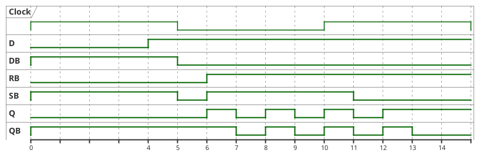

#+title: ECE 403 Assignment 9
#+options: tags:nil todo:nil num:nil toc:nil title:nil
#+author: Waridh (Bach) Wongwandanee
#+setupfile: ../latex-setup.config
#+property: header-args:emacs-lisp :exports none :tangle no
#+property: header-args:elisp :exports none :tangle no
#+LATEX_HEADER: \chead{Assignment 9}

* Question 1
For a circuit:
asynchronous input -- D-FF -- combinational logic -- D-FF,
find an expression for the decision time.
Find the max clock rate that will give this system a MTBF of the current age of the universe.
If there’s no closed form solution, try a recurrence relation (i.e. \(x = f(x)\) or \(x = f^{-1} (x)\), whichever one converges).
\(T_{pd} = \qty{900}{\pico\s},~T_{setup}=\qty{60}{\pico\s},~T_{hold}=\qty{50}{\pico\s},~T_{pcq}=\qty{90}{\pico\s},~T_{ccq}=\qty{70}{\pico\s},~\tau_m=\qty{20}{\pico\s};~T_w=\qty{120}{\pico\s};~f_{data}=\qty{20}{\mega\hertz}\).

#+name: fig-q1-prompt
#+caption: The block diagram of the system being described in question 1.
[[file:images/q1-system.png]]

For this problem, we have to use the current age of the universe, which we are going to claim is 13.787 billion years old[fn:: https://en.wikipedia.org/wiki/Age_of_the_universe].
We are going to convert this value to seconds so that things are normalized. The age of the universe in seconds is src_elisp[:exports results]{(* 13.787e9 365.25 24 60 60 1e12)}  \unit{\pico\s}.
We shall use this number at a later time.

Now, to find the decision time, we are looking to find the time where if you are not able to make a decision by this time, the system has failed.
Well, we say that the system will fail if a stable value cannot be produced before the setup time of second DFF in the system.
Now, considering the combinational component, we have to add the propagation delay of the combinational component into account as well.
With those factors in mind, we set the decision time to ([[eq-decision-time]]).

#+name: eq-decision-time
\begin{equation}
t = T_{C} - \left( t_{setup} + t_{pd} \right)
\end{equation}

\begin{equation}
f_{clock} = \frac{1}{T_c}
\end{equation}

Moving on to finding the max clock rate that could reach the specified MTBF, we use the expression from lecture, ([[eq-mtbf]]).
With this, we just need to substitute in \(f_{clock}\) and \(t\) with the values that we found.
After this substitution, we have ([[eq-new-mtbf]]).

#+name: eq-mtbf
\begin{equation}
MTBF = \frac{e^{t/ \tau_m}}{T_w f_{clock} f_{data}}
\end{equation}

#+name: eq-new-mtbf
\begin{equation}
  MTBF = \frac{ T_c \times e^{\left( T_c - t_{setup} - t_{pd} \right) / \tau_m}}{T_w f_{data} }
\end{equation}

Looking at ([[eq-new-mtbf]]), we see that we should use a mathematical tool to solve for this.
I think that we are allowed to use constraint solvers in this course, so I put this expression into Wolfram Alpha[fn:: https://www.wolframalpha.com/] to solve for \(T_{c}\).
The resulting value of \(T_{c}\) is \qty{2051.73}{\pico\s}.

* Question 2
Perform a manual simulation (all gates have a propagation delay of \qty{1}{\nano\s}) on this D-latch based on
an SR latch with D rising \qty{1}{\nano\s} before CLK falls (a
setup time violation). If the answer looks wrong, you
probably have it right.

#+name: fig-q2-prompt
#+caption: The diagram of the latch, as well as the initial component of the timing diagram that will be analyzed.
#+attr_latex: :width 0.7\linewidth
[[file:images/q2-prompt.png]]

The timing diagram for this problem is available in figure [[fig-q2-result]].

#+name: lst-q2-timing
#+begin_src plantuml :exports results :results file :file ./images/q2-timing.png
@startuml
clock "Clock" as clk with period 10
binary "D" as d
binary "DB" as db
binary "RB" as rb
binary "SB" as sb
binary "Q" as q
binary "QB" as qb

@0
d is low
sb is high
db is high
qb is high

@4
d is high

@5
db is low
sb is low

@6
sb is high
rb is high
q is high

@7
qb is low
q is low

@8
qb is high
q is high

@9
q is low
qb is low

@10
q is high
qb is high

@11
sb is low
q is low
qb is low

@12
q is high
qb is high

@13
q is high
qb is low

@14
q is high
qb is low
@enduml
#+end_src

#+name: fig-q2-result
#+caption: The resulting timing diagram for question 2.
#+RESULTS: lst-q2-timing

